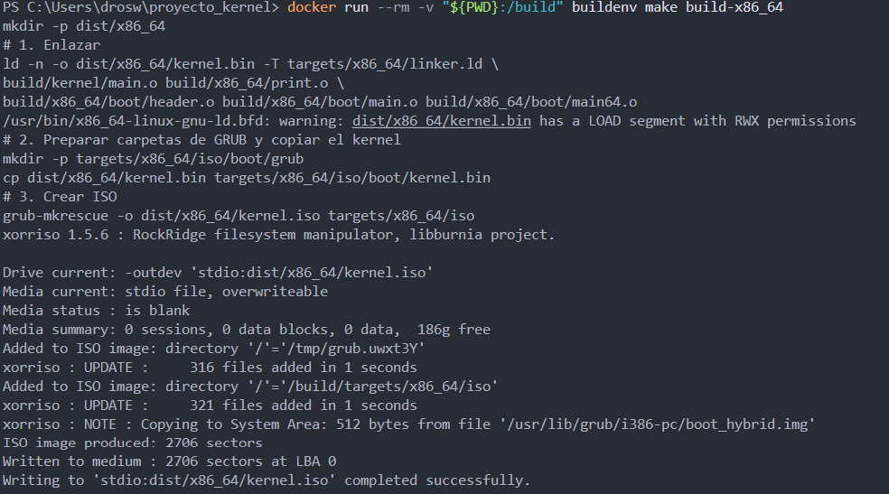
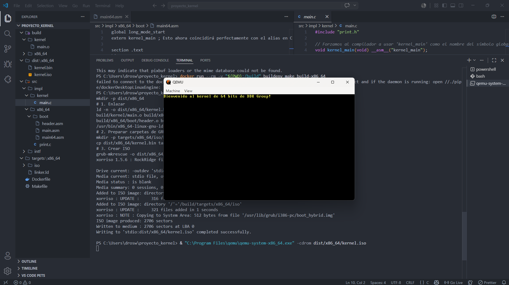

# PART 2 — Building a 64-bit Kernel

This document details the process of building our 64-bit operating system kernel. The project is divided into two main episodes, showcasing the code and commands we developed.

## Project Structure
- `src/`: Main source code (implementations in C and Assembly).
- `targets/x86_64/`: Linker scripts (linker.ld) and bootloader configuration (grub.cfg).
- `Dockerfile`: Reproducible build environment (GCC cross-compiler, NASM, GRUB, xorriso).
- `Makefile`: Automation of the compilation and packaging process.

## Requirements
- [Docker Desktop](https://www.docker.com/products/docker-desktop/) installed and running.
- [QEMU](https://www.qemu.org/) installed for emulation.

## 1. Build Environment (Docker)
To ensure a reproducible environment and avoid compatibility issues with the cross-compiler on our host systems, we encapsulate all dependencies in a Docker container.

****

* **Image creation command:** `docker build -t buildenv .`
* **Compilation command:** `docker run --rm -v "${PWD}:/build" buildenv make build-x86_64`
* **Rationale:** In this section, we configure native dependencies such as GCC cross-compiler, NASM, and GRUB, which can generate difficult-to-trace errors. With the `Dockerfile`, we install the exact dependencies in a Linux-based image. The `Makefile` allowed us to automate the creation of `build/` and `dist/` directories, as well as compile object files (`.o`) and generate the final ISO image without manually typing commands each time.

## 2. Episode 1: Minimum Viable Product (Multiboot2)
The first step was to get the processor to execute our initial code (written in 32-bit Assembly) and write to video memory.

****

* **Command executed by Makefile:** `nasm -f elf64 src/impl/x86_64/boot/main.asm -o build/x86_64/boot/main.o`
* **Rationale:** Here we created the `header.asm` file with the "magic number" (`0xe85250d6`) required by the Multiboot2 specification. This is mandatory for the bootloader (GRUB) to recognize our binary as a valid operating system. Additionally, we designed the `linker.ld` script to specify that the entry point is `start` and that our code should be loaded at the 1 Megabyte mark in memory, avoiding overwriting areas reserved by the hardware.

## 3. Episode 2: 64-bit Kernel (Long Mode)
We performed the transition from 32-bit to 64-bit mode and successfully linked our assembly code with logic written in C.

****

* **C compilation command:** `gcc -c -I src/intf -ffreestanding src/impl/kernel/main.c -o build/kernel/main.o`
* **Linking command:** `ld -n -o dist/x86_64/kernel.bin -T targets/x86_64/linker.ld [objects]`
* **Rationale:** In this phase, we configured page tables to map the first Gigabyte of memory and created a 64-bit GDT (*Global Descriptor Table*) to enable *Long Mode*.
For C integration, we compiled with the `-ffreestanding` flag because our kernel does not have access to standard system libraries. To solve linking issues (Name Mangling) between Assembly and C, we forced the symbol naming in C using `__asm__("kernel_main")`, ensuring that the linker (`ld`) could connect the jump from `main64.asm` to our main function in C.

## 4. Final Result and Emulation (QEMU)
We generated the final `kernel.iso` file using `grub-mkrescue` and emulated it.

**
**

* **Emulation command:** `qemu-system-x86_64 -cdrom dist/x86_64/kernel.iso`
* **Rationale:** The use of the emulator allowed us to validate that our `kernel.bin` was correctly packaged by GRUB inside the `/boot/` directory of the ISO. The colored message printed to the screen (yellow on black) proves that the `print_str` function implemented in C was able to successfully write to the virtual video memory buffer (`0xb8000`), confirming that the entire execution flow—from the bootloader to the high-level logic—works correctly.

## 5. Demonstration Video
https://drive.google.com/file/d/1vilZdaRI5FEhHh9iwZX1X7WPXQcUJYWj/view?usp=drive_link

---
*Developed by: Darwin Román (DDK Group)*